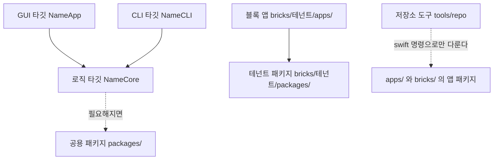

<!-- template:begin -->
# 구조

## 목적

이 저장소는 macOS 앱 여러 개를 담는 Swift 모노레포입니다. 저장소 주인과 에이전트가 앱을 하나씩 만들고 고치며, 저장소 도구 `repo` 가 앱을 만들고 점검하고 실행합니다. 이 템플릿으로 만든 다른 저장소(테넌트)의 앱을 블록으로 받아 함께 둘 수도 있습니다. 저장소의 일부는 템플릿이 관리하고 템플릿의 새 판으로 교체되며, 나머지는 저장소 주인의 것입니다.

## 폴더 배치

```
<저장소>/
├── apps/             앱. 폴더 하나가 앱 하나다
├── packages/         두 앱 이상이 쓰는 공용 코드. 필요해질 때 만든다
├── bricks/           테넌트에서 받은 블록. bricks/<테넌트>/ 는 테넌트 저장소의 apps/, packages/ 모양 그대로다
├── bricks.lock       받은 블록의 테넌트, 판, 커밋, 앱, 패키지 기록
├── templates/        repo new 가 복사하는 앱 틀
├── tools/repo/       저장소 도구 repo 의 소스와 테스트
├── decisions/        결정 기록. template/ 아래는 템플릿이 내린 결정이다
├── Package.swift     루트 패키지. repo 도구만 담는다
├── index.md          앱과 패키지 README 목록. okf sync 가 만든다
├── template.json     템플릿 판과 템플릿이 관리하는 경로
├── repo.json         앱 번들 ID 앞부분, 템플릿 출처, 등록한 테넌트
└── .swift-format     lint 설정
```

앱 폴더 하나는 독립된 Swift 패키지이며, 안의 배치는 모든 앱이 같습니다. `<Name>` 은 slug 를 PascalCase 로 바꾼 이름입니다(`memo-board` 는 `MemoBoard`).

```
apps/<slug>/
├── Package.swift            앱 패키지
├── README.md                앱 설명과 사용법
├── VERSION                  앱 버전(x.y.z)
├── Packaging/Info.plist     .app 정보. 버전 키는 bundle 이 VERSION 으로 채운다
├── Sources/<Name>Core/      로직
├── Sources/<Name>App/       SwiftUI GUI
├── Sources/<Name>CLI/       CLI
└── Tests/<Name>CoreTests/   Core 테스트
```

블록 앱의 배치도 같습니다. 블록 앱은 `bricks/<테넌트>/apps/<slug>/` 에 있고, 명령에서는 `<테넌트>/<slug>` 로 가리킵니다.

앱 목록과 버전은 `swift run repo list` 로, 받은 블록은 `swift run repo brick list` 로, 템플릿 판은 `swift run repo template status` 로, 명령과 옵션은 `swift run repo help` 로 확인합니다. 템플릿이 관리하는 경로는 `template.json` 에 있습니다.

## 의존 방향



화살표를 거꾸로 따라가는 의존은 허용하지 않습니다. 주인 앱에서 블록 쪽으로 가는 의존도 없습니다. 실제 의존은 각 앱의 `Package.swift` 와 루트 `Package.swift` 에 적혀 있습니다. 저장소 도구는 앱의 코드를 import 하지 않고 `swift build` 같은 명령을 실행해서 앱을 다룹니다.

## 주요 흐름

앱을 만들거나 기능을 더할 때는 다음 순서로 작업합니다.

1. 새 앱이면 `swift run repo new <slug>` 로 앱 폴더를 만듭니다.
2. Core 에 로직과 테스트를 더합니다.
3. 같은 기능을 CLI 명령과 GUI 에 연결합니다.
4. 앱 `README.md` 의 사용법과, 필요하면 CLI 도움말을 고칩니다.
5. VERSION 이나 path 의존을 바꿨다면 `swift run repo okf sync` 로 README 와 `index.md` 의 생성 블록을 갱신합니다.
6. `swift run repo check <slug>` 로 lint, 빌드, 테스트를 확인합니다.
7. `swift run repo run <slug>` 로 실행해 보고, `.app` 이 필요하면 `swift run repo bundle <slug>` 를 씁니다.
8. 되돌리기 어려운 결정을 내렸다면 `decisions/` 에 기록을 더합니다.

블록을 받고 새 판으로 바꿀 때는 다음 순서로 작업합니다.

1. 저장소 주인이 테넌트를 `repo.json` 의 `tenants` 에 등록하고 커밋합니다.
2. `swift run repo brick available <테넌트>` 로 앱을 고르고 `swift run repo brick add <테넌트>/<앱>` 으로 받습니다.
3. `swift run repo check` 로 확인한 뒤 커밋합니다.
4. 테넌트의 새 판은 `swift run repo brick update <테넌트> --dry-run` 으로 먼저 보고, `swift run repo brick update <테넌트>` 로 받습니다.
5. 블록을 고쳐 써야 하면 `swift run repo brick eject <테넌트>/<앱>` 으로 주인 앱으로 옮긴 뒤 고칩니다.

각 명령의 자세한 동작은 `swift run repo help brick` 이, 템플릿의 새 판을 받는 흐름은 `swift run repo help template` 이 설명합니다.

템플릿으로 만들지 않고 이미 운영하던 저장소에 템플릿을 처음 들일 때는, 템플릿 checkout 에서 `swift run repo template adopt <저장소 경로> --dry-run` 으로 바뀔 경로를 먼저 보고 `--dry-run` 없이 들입니다. 그다음 들인 저장소에서 `swift run repo doctor` 로 확인하고 커밋합니다. 규칙 문서에 있던 기존 내용은 주인 절로 옮겨지므로, 저장소 주인이 템플릿 구역과 겹치는 내용을 정리합니다.

## 경계

- **템플릿 관리 영역과 저장소 주인 영역:** 템플릿이 관리하는 경로는 `template.json` 의 `managedPaths` 와 `managedBlocks` 가 정하며, 이 파일이 정본입니다. 관리 영역은 템플릿 업데이트 때 교체되고, 그 밖의 파일과 템플릿 구역 표시 밖의 글은 업데이트가 건드리지 않습니다.
- **앱과 앱 사이:** 앱 패키지는 서로 의존하지 않습니다. 여러 앱이 같은 코드를 쓸 때는 그 코드를 `packages/<name>/` 의 패키지로 옮기고, 앱들이 그 패키지에 의존합니다.
- **앱 안:** GUI 타깃과 CLI 타깃은 Core 타깃에 의존하고, Core 타깃은 두 타깃에 의존하지 않습니다.
- **주인 앱과 블록:** 주인 앱은 블록 앱을 import 하지 않고, 블록의 테넌트 패키지(`bricks/<테넌트>/packages/`)에도 의존하지 않습니다. 블록을 새 판으로 바꾸거나 eject 해도 주인 앱이 깨지지 않게 하기 위해서입니다.
- **블록 수정:** 블록은 `bricks/` 안에서 고치지 않고, eject 로 주인 영역에 옮긴 뒤에만 고칩니다. `bricks/` 와 `bricks.lock` 은 `repo brick` 명령이 관리하며, 템플릿 관리 영역이 아니므로 템플릿 업데이트가 건드리지 않습니다.
- **책임:** 틀인 이 템플릿은 블록의 내용을 보증하지 않습니다. 블록의 내용은 그 테넌트가, 무엇을 받아 쓸지는 저장소 주인이 책임집니다. 주인이 그 책임을 질 수 있도록 틀은 테넌트 등록, 커밋 고정, 미리 보기를 둡니다([결정 0005](decisions/template/0005-bricks-from-tenants.md)).

## 변경 규칙

이 문서와 README 를 고치는 사람과 에이전트는 https://github.com/dalsoop/stable-agent-documentation-guidebook 의 `guides/new-project.md` 3절을 따릅니다(커밋 f283b21 기준). 이 절에는 이 저장소에만 해당하는 내용을 적습니다. 기능이 바뀌어도 이 문서에 설명을 더하지 않고, 동작은 도구의 도움말에, 이유는 결정 기록에 둡니다.

### 독자

| 문서 | 독자 | 독자 과제 | 마지막 독자 시험 |
|---|---|---|---|
| `README.md` | 저장소를 처음 보는 사람이나 에이전트 | 저장소가 무엇이고 왜 있는지 알고, 한 번 실행하고, 다음 문서를 찾는다 | 아직 하지 않음 |
| `ARCHITECTURE.md` | 코드를 바꿀 기여자(사람과 에이전트) | 변경이 어디로 가는지, 어떤 경계를 지켜야 하는지 찾는다 | 아직 하지 않음 |
| `AGENTS.md` (`CLAUDE.md` 는 같은 파일) | 매 작업 전의 에이전트 | 사람에게 묻지 않고 관례를 지키는 변경을 한다 | 아직 하지 않음 |
| `decisions/` | 결정을 바꾸려는 사람이나 에이전트 | 왜 그렇게 정했고 어떤 대안이 기각되었는지 안다 | 아직 하지 않음 |
| 앱의 `README.md` | 그 앱을 쓰거나 고칠 사람이나 에이전트 | 앱이 무엇인지 알고, 실행하고, 명령 도움말을 찾는다 | 아직 하지 않음 |

### 예외

- 가이드북은 원본을 영어(Simplified Technical English)로 쓰고 번역본을 따로 둡니다. 이 저장소는 한국어 원본 하나만 둡니다. 이유는 [decisions/template/0003](decisions/template/0003-documentation-standard.md) 에 있습니다.
- 9단계(코드가 바뀌면 문서를 다시 읽게 하는 해시 점검)와 10단계(낡은 참조 경고)는 적용하지 않습니다. 특정 코드 파일에 묶인 문서가 없고, 낡은 참조 검사는 상대 링크 점검까지만 합니다.

### 다시 읽기

6개월마다 모든 문서를 다시 읽고, 이유가 없어진 규칙과 독자의 행동을 바꾸지 않는 문장을 지웁니다. 마지막 검토: 2026-09-26.

### 점검 상태

- `swift run repo doctor` 가 확인하는 것: git 이 보는 파일 가운데 컨텍스트 파일(`AGENTS.md`, `CLAUDE.md`)이 루트에만 있는지, 이 문서의 필수 제목, `README.md`·`ARCHITECTURE.md`·`AGENTS.md`·`index.md` 와 앱·패키지 README 의 상대 링크, 생성 블록(`okf:derived`)이 코드와 같은지와 표시 오류, 루트 항목이 허용 목록 안에 있는지, `apps/`·`packages/` 폴더 이름(kebab-case, 직시어·종류 단어·날짜 숫자 없음), 템플릿 구역 표시의 짝, 앱마다 필수 파일과 VERSION 형식, `apps/`·`packages/` 의 path 의존이 모두 있는 `packages/<이름>` 을 가리키는지(앱끼리 의존하거나 주인 앱이 블록에 의존하면 FAIL), `tenants` 의 이름 형식, `bricks.lock` 과 `bricks/` 가 일치하는지. 블록 앱의 필수 파일은 경고로만 알립니다.
- `swift run repo lint` 가 확인하는 것: 주인 앱의 Swift 코드 서식과 필수 파일. 블록은 보지 않습니다.
- 사람이 확인해야 하는 것: 로직이 Core 에만 있는지, GUI 로 되는 일이 CLI 로도 되는지, 새 동작에 Core 테스트가 있는지, 비밀이 커밋되지 않았는지, 외부 패키지에 결정 기록이 있는지, 한 내용이 한 곳에만 있는지, 한국어 문장이 fluent-korean 을 따르는지, 관리 영역과 블록을 직접 고치지 않았는지(확인 방법은 `swift run repo help template` 과 `swift run repo help brick`).

## 참고

- 문서 작성 가이드북: https://github.com/dalsoop/stable-agent-documentation-guidebook (커밋 f283b21)
- 한국어 문장 지침: https://github.com/snflkd/fluent-korean
- 템플릿이 내린 결정: [decisions/template/](decisions/template/)
<!-- template:end -->

## 이 저장소의 구조 메모

이 저장소에만 해당하는 구조 설명은 이 아래에 적습니다. 위 구역은 템플릿 업데이트 때 교체됩니다.
