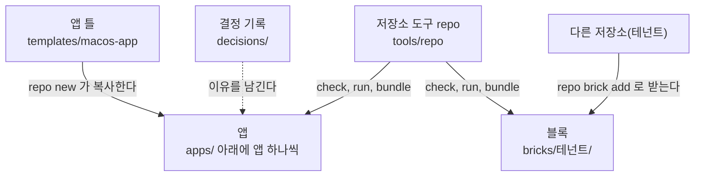
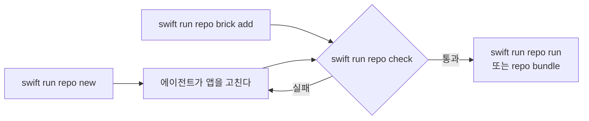

# Gujo 앱 템플릿

Gujo 앱 템플릿은 macOS 앱 여러 개를 한 저장소에서 만들고 관리하기 위한 출발점입니다. 에이전트(Claude Code, Codex 등)가 앱을 하나씩 만들고, 저장소 도구 `repo` 가 앱을 만들고 점검하고 실행합니다. 이 템플릿은 외부 의존이 없어서 Xcode 와 git 만 있으면 동작합니다. 이 템플릿으로 만든 다른 저장소(테넌트)의 앱을 블록처럼 받아 이 저장소에 조립할 수도 있습니다. 템플릿의 새 판이 나오면 템플릿이 관리하는 부분만 받아서 교체할 수 있습니다. 구조와 경계는 [ARCHITECTURE.md](ARCHITECTURE.md) 에, 에이전트가 지키는 규칙은 [AGENTS.md](AGENTS.md) 에 있습니다.

## 구조



## 동작 방식



## 시작하기

macOS 15 이상, Xcode 16.3 이상(Swift 6.1 이상), git 이 필요합니다. 에이전트 CLI 는 각자 준비합니다.

1. 템플릿 저장소([github.com/gujoai/gujo-apps-mono-template](https://github.com/gujoai/gujo-apps-mono-template))에서 **Use this template** 을 눌러 자기 저장소를 만들고 clone 합니다.
2. 아래 첫 명령으로 환경을 점검합니다. 처음 실행할 때는 `repo` 도구를 빌드하느라 시간이 조금 걸립니다.
3. `repo.json` 의 `bundlePrefix` 를 자기 도메인을 뒤집은 값(예: `com.mycompany`)으로 바꿉니다.
4. 저장소 루트에서 에이전트에게 "apps 에 메모 보드 앱을 만들어 줘" 처럼 부탁합니다.

## 첫 명령

```sh
swift run repo doctor          # 환경과 저장소 구조를 점검한다
swift run repo new <slug>      # 앱을 하나 만든다
swift run repo check <slug>    # lint, 빌드, 테스트를 한 번에 돌린다
swift run repo help            # 모든 명령과 설명을 본다
```

첫 실행은 Xcode 쪽 준비가 덜 되었을 때 자주 실패합니다. Xcode 를 설치한 뒤 한 번 실행해서 추가 구성 요소 설치와 라이선스 동의를 마쳐야 합니다. 또한 `xcode-select -p` 가 Command Line Tools 를 가리키면 오래된 Swift 가 쓰일 수 있으므로, `sudo xcode-select -s /Applications/Xcode.app` 으로 Xcode 를 선택합니다. `swift run repo doctor` 가 어느 쪽이 문제인지 알려 줍니다.

템플릿의 새 판을 받는 방법은 `swift run repo help template` 이, 다른 저장소의 앱을 블록으로 받는 방법은 `swift run repo help brick` 이 설명합니다.

## 책임

이 템플릿은 틀만 제공합니다. 블록의 내용은 그 블록을 발행한 각 테넌트가 책임지고, 어떤 블록을 받아 쓸지는 저장소 주인이 정하고 책임집니다. 이 템플릿은 블록을 검수하거나 보증하지 않습니다.

## 문서 작성 기준

이 저장소의 문서는 [stable-agent-documentation-guidebook](https://github.com/dalsoop/stable-agent-documentation-guidebook) 을 따라 작성합니다. 한국어 문장은 가이드북이 한국어에 지정한 [fluent-korean](https://github.com/snflkd/fluent-korean) 지침을 따릅니다. 이 저장소의 문서를 쓰거나 고치는 사람과 에이전트도 같은 기준을 따릅니다.

## 라이선스

템플릿에서 온 파일은 [MIT 라이선스](LICENSE)로 제공됩니다. 이 저장소에서 만든 앱과 그 밖의 파일에 어떤 라이선스를 적용할지는 저장소 주인이 정합니다.

## 고지

이 템플릿은 있는 그대로 제공되며, 어떠한 명시적·묵시적 보증도 하지 않습니다. 이 템플릿으로 만든 앱과 그 앱의 배포·사용에 대한 책임은 전적으로 저장소 주인에게 있습니다. 에이전트가 만든 코드는 사용하기 전에 직접 검토하십시오.
